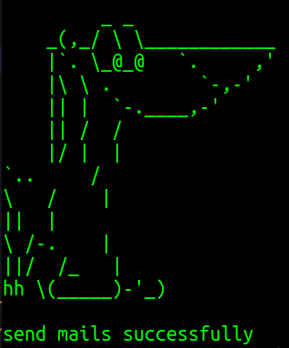

# User guide

### Termux

---

    apt update
    apt upgrade
    pkg install git
    pkg install python3
    git clone https://github.com/marufjs/gmail_bomber.git
    cd gmail-bomber

### Terminal

---

    sudo apt install git
    sudo apt install python3
    git clone https://github.com/marufjs/gmail_bomber.git
    cd gmail-bomber

## What things to edit before running this process?

---

open a text editor

if you are on a mobile phone then install Acode or Anwriter from play store

open the gmail_bomber.py file in the editor

gmail id --> replace it with your own gmail account

gmail password --> replace it with your own gmail password

subject --> type your own subject

body --> type your own message inside "", for create a new line type \n

listOfAddress --> enter your target mail addresses. If you have multiple accounts then follow this format
["yourMail@gmail.com","yourMail@gmail.com","yourMail@gmail.com","yourMail@gmail.com","yourMail@gmail.com","yourMail@gmail.com"]

ob.sendmail --> type your username inside ""

save this file

now [click here](https://myaccount.google.com/security) and scroll down and turn on less secure app access

open termux or terminal again

---

## After that run this command

---

    python3 gmail_bomber.py
